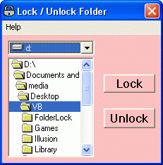



## Folder Lock

### Description

This application is an inspiration from necessity. A very useful application that locks your personal or confidential folders and prevents external misuse or intrusion.
 
### More Info
 

             |
---                |---
**Submitted On**   |2007-05-15 15:46:10
**By**             |[Subarno Banerjee](https://github.com/Planet-Source-Code/PSCIndex/blob/master/ByAuthor/subarno-banerjee.md)
**Level**          |Beginner
**User Rating**    |4.7 (14 globes from 3 users)
**Compatibility**  |VB 3\.0, VB 4\.0 \(16\-bit\), VB 4\.0 \(32\-bit\), VB 5\.0, VB 6\.0
**Category**       |[Windows System Services](https://github.com/Planet-Source-Code/PSCIndex/blob/master/ByCategory/windows-system-services__1-35.md)
**World**          |[Visual Basic](https://github.com/Planet-Source-Code/PSCIndex/blob/master/ByWorld/visual-basic.md)
**Archive File**   |[Folder\_Loc2065985162007\.zip](https://github.com/Planet-Source-Code/subarno-banerjee-folder-lock__1-68605/archive/master.zip)

